# Modified-loss-functions-of-GAN-model-for-image-style-transfer-problem

<table>
  <tr>
    <td> Content
    <td>
    <td>
    <td> Style
  </tr>
  
  <tr>
    <td> 
    <td> 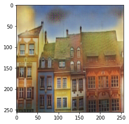
    <td> 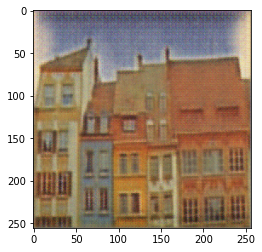
    <td> 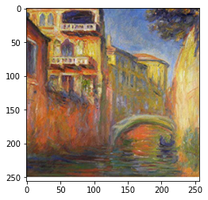
  </tr>
  
  <tr>
    <td> 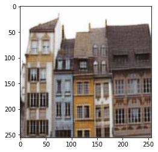
  </tr>
  
  <tr>
    <td> 
    <td>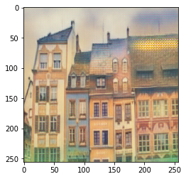
    <td>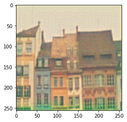
    <td>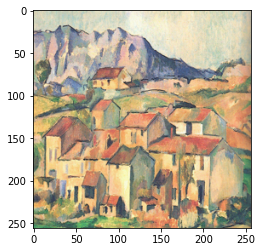
  </tr>
</table>

<table>
  <tr>
    <td> Content 
    <td>
    <td>
    <td> Style
  </tr>
  
  <tr>
    <td> 
    <td> 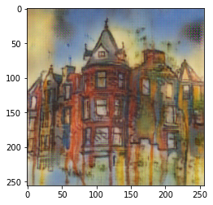
    <td> 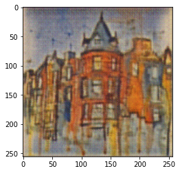
    <td> 
  </tr>
  
  <tr>
    <td> 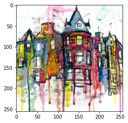
  </tr>
  
  <tr>
    <td>
    <td>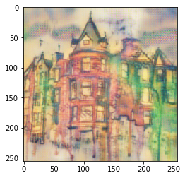
    <td>
    <td>
  </tr>
</table>
