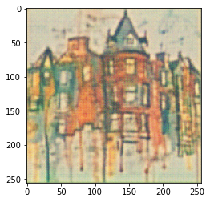

# Modified-loss-functions-of-GAN-model-for-image-style-transfer-problem

Image style transfer is an interesting research in computer vision. The combination of artificial intelligence and art makes this technique highly concerned in the relevant technical fields and art fields. Recent studies have focused on improving the relationship between object and style. There are many proposals for the loss function to improve this.

Specifically, I have summarized some proposals for loss function and experimented with some models including CycleGAN, GAN model with dual-consistency loss.

Details on: 

Results and comparison:
<table>
  <tr>
    <td> Content
    <td> Dual Consistency loss GAN
    <td> Cycle GAN
    <td> Style
  </tr>
  
  <tr>
    <td> 
    <td> 
    <td> 
    <td> 
  </tr>
  
  <tr>
    <td> 
  </tr>
  
  <tr>
    <td> 
    <td>
    <td>
    <td>
  </tr>
</table>

<table>
  <tr>
    <td> Content 
    <td> Dual Consistency loss GAN
    <td> Cycle GAN
    <td> Style
  </tr>
  
  <tr>
    <td> 
    <td> 
    <td> 
    <td> 
  </tr>
  
  <tr>
    <td> 
  </tr>
  
  <tr>
    <td>
    <td>
    <td>
    <td>
  </tr>
</table>
